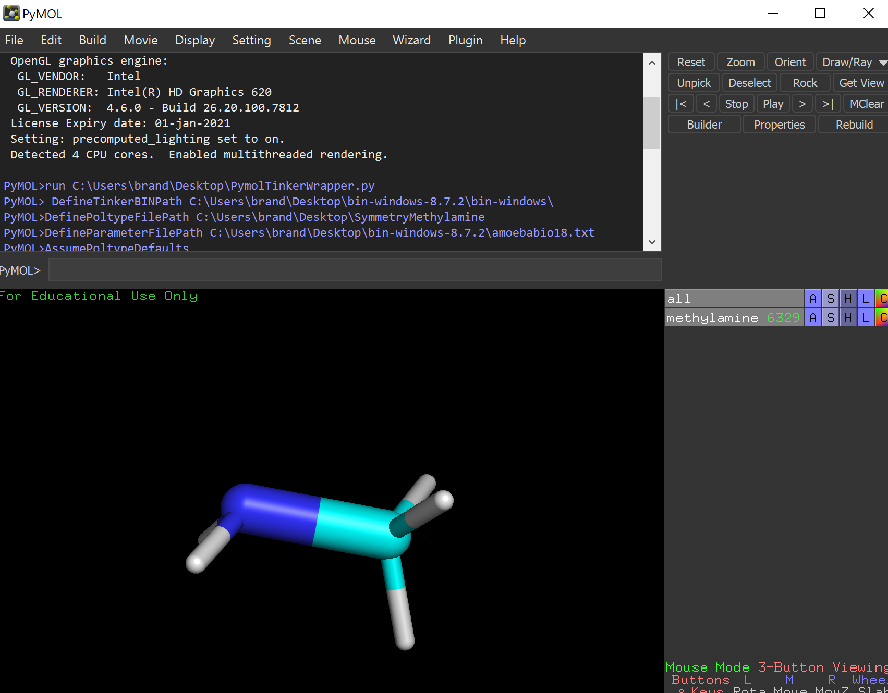
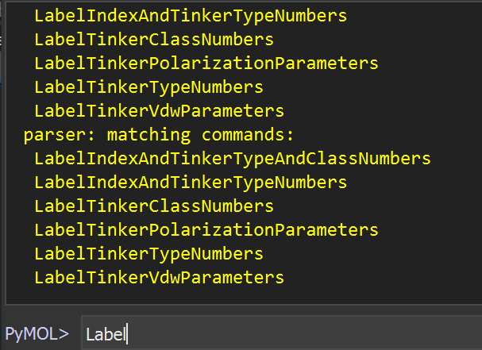
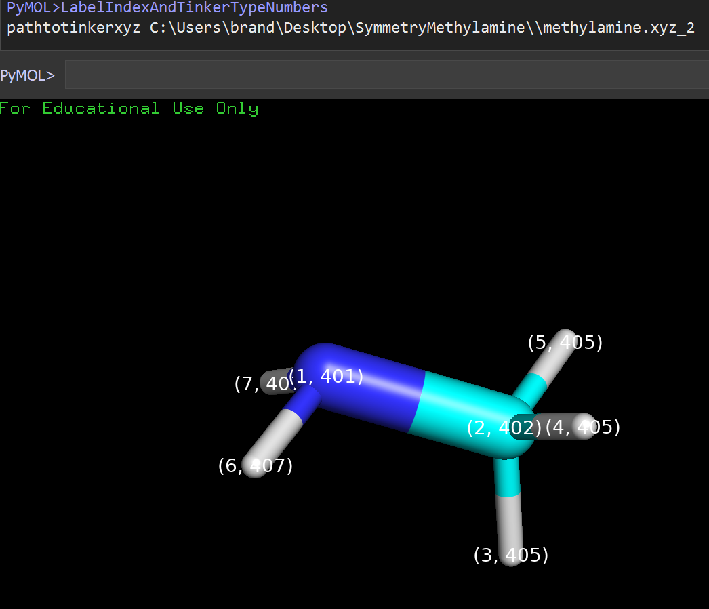
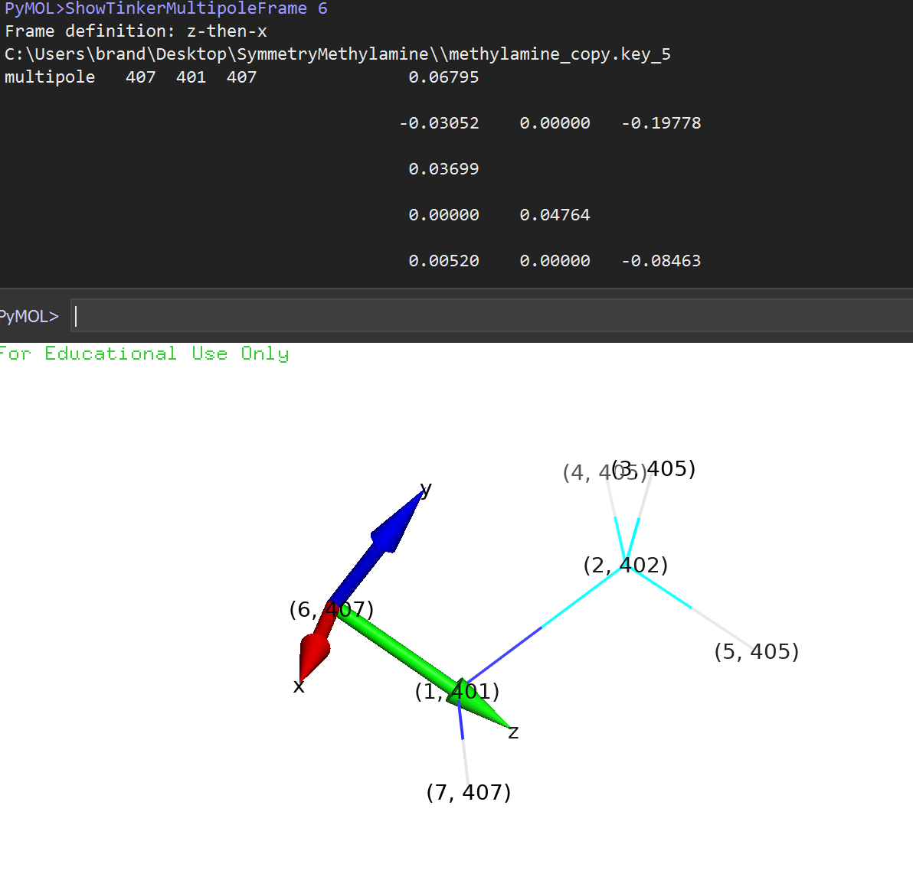
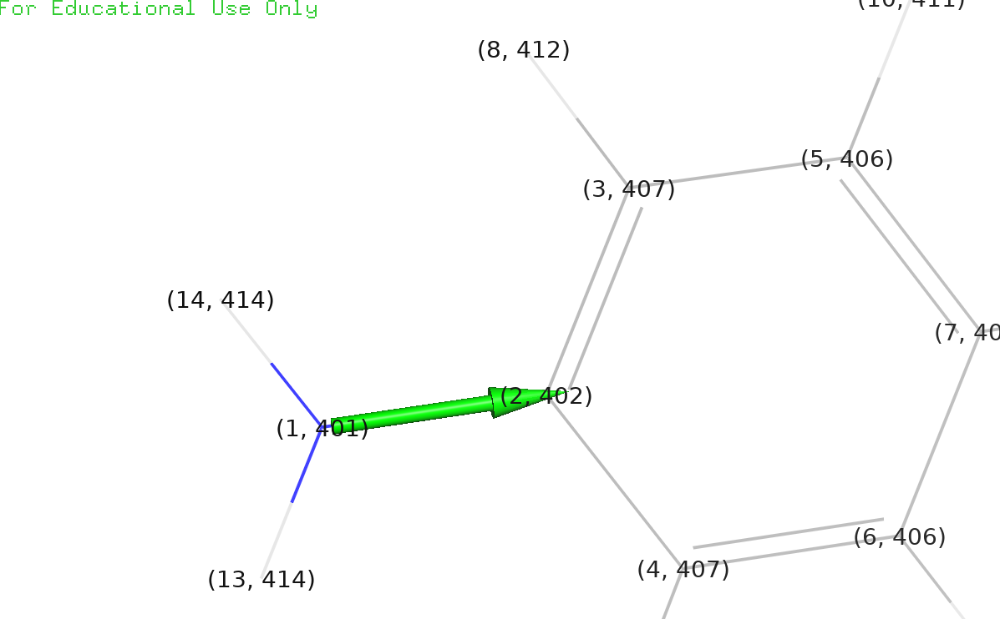
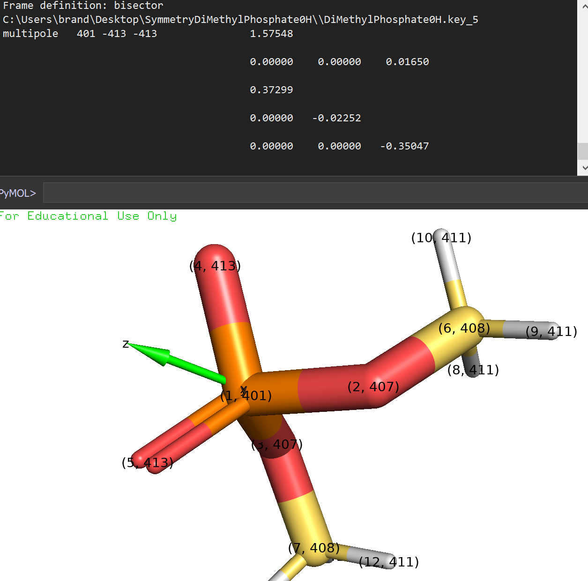
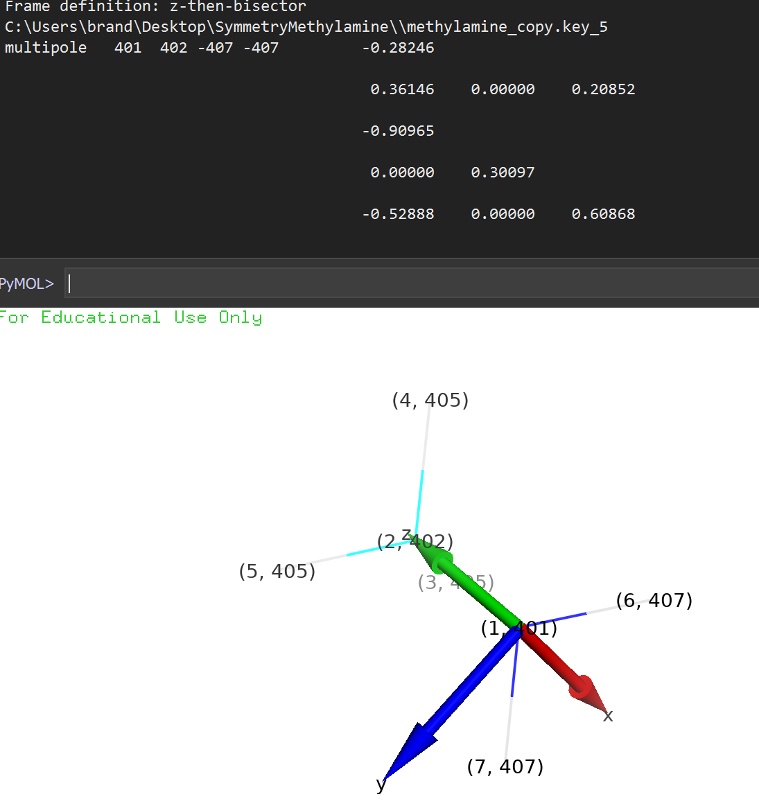
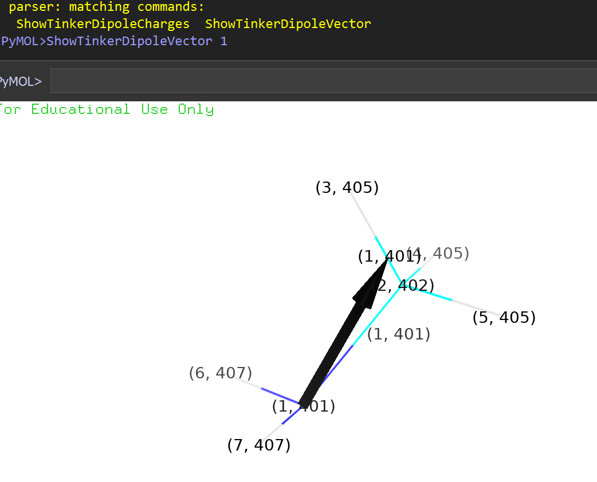
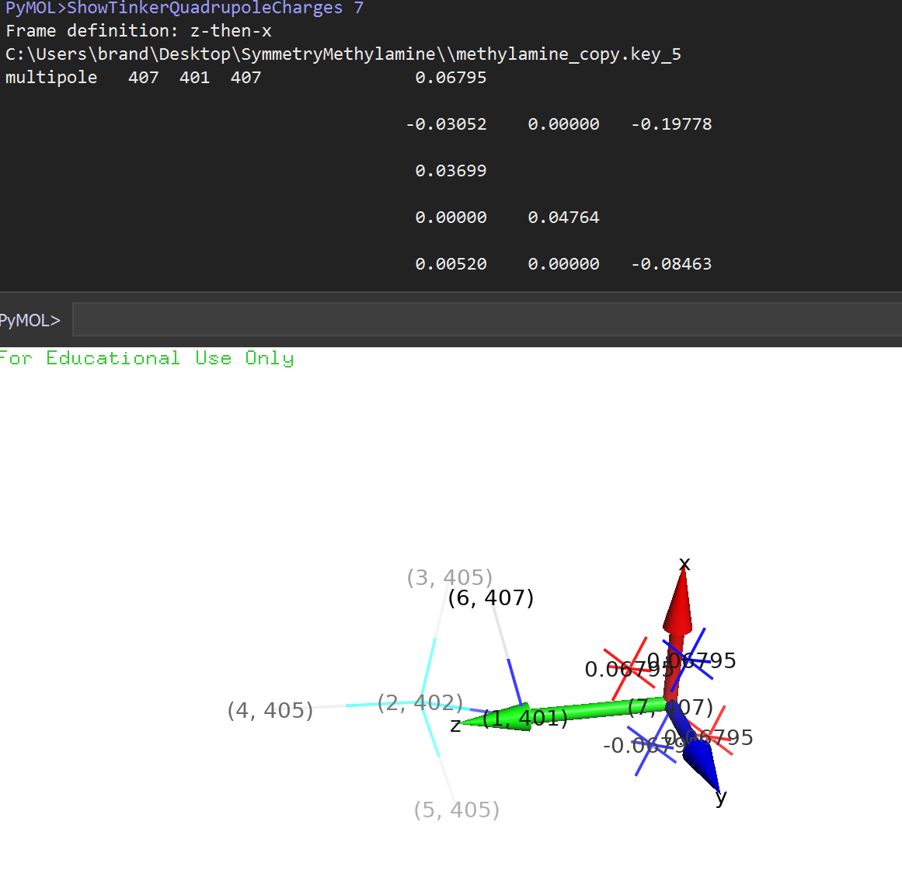

### Usage
#
* VANTAGE - Visually Augmented Newtonian Theories for Analysis and Graphing Energies

* Current support is only for AMOEBA model
* Future support for other common moleculer dynamic (newtonian theories) models such as AMBER, HIPPO and CHARMM

## Initializing Pymol-Tinker Interface

* Open PyMol
* locate the command terminal in PyMol

```shell
"run C:\Users\brand\Desktop\vantage.py"
"DefineTinkerBINPath C:\Users\brand\Desktop\bin-windows-8.7.2\bin-windows\ "
"DefinePoltypeFilePath C:\Users\brand\Desktop\SymmetryMethylamine "
"DefineParameterFilePath C:\Users\brand\Desktop\bin-windows-8.7.2\amoebabio18.txt "
"AssumePoltypeDefaults()"

```


* Default loading display



* Auto command parser (tab key)




## Label Commands

* LabelTinkerTypeNumbers
* LabelIndexAndTinkerTypeNumbers
* LabelIndexAndTinkerTypeAndClassNumbers
* LabelTinkerClassNumbers
* LabelTinkerPolarizationParameters atomindex
* LabelTinkerVdwParameters atomindex


## Print Commands
* PrintTinkerPolarizationParameters atomindex1
* PrintTinkerVdwParameters atomindex1
* PrintTinkerBondParameters atomindex1, atomindex2
* PrintTinkerAngleParameters atomindex1, atomindex2, atomindex3
* PrintTinkerStretchBendParameters atomindex1, atomindex2, atomindex3
* PrintTinkerTorsionParameters atomindex1, atomindex2, atomindex3, atomindex4
* PrintTinkerMultipoleParameters atomindex
* PrintTinkerTotalCharge
* PrintTinkerComponentEnergy

## Defining path variables
* DefineTinkerBINPath path
* DefineTinkerFinalXYZFilePath path
* DefineTinkerXYZFilePath path
* DefineTinkerKeyFilePath path
* DefineTinkerFinalKeyFilePath path
* DefinePoltypeFilePath path

## Modifying Parameters in Tinker keyfile
* ChangeTinkerVdwParameters atomindex, parameter1, parameter2
* ChangeTinkerPolarizationParameters atomindex, parameter1, parameter2
* ChangeTinkerBondParameters atomindex1, atomindex2, paramter1, parameter2
* ChangeTinkerAngleParameters atomindex1, atomindex2, atomindex3, paramter1, parameter2
* ChangeTinkerStretchBendParameters atomindex1, atomindex2, atomindex3, paramter1, parameter2
* ChangeTinkerTorsionParameters atomindex1, atomindex2, atomindex3, atomindex4, parameter1, parameter2, parameter3

## Adding Parameters to Tinker keyfile
* AddTinkerVdwParameters atomindex, parameter1, parameter2
* AddTinkerPolarizationParameters atomindex, parameter1, parameter2
* AddTinkerBondParameters atomindex1, atomindex2, parameter1, parameter2
* AddTinkerAngleParameters atomindex1,atomindex2, atomindex3, parameter1, parameter2
* AddTinkerStretchBendParameters atomindex1,atomindex2, atomindex3, parameter1, parameter2
* AddTinkerTorsionParameters atomindex1, atomindex2, atomindex3, parameter1, parameter2, parameter3

## Showing Tinker Electrostatic Parameters

* ShowTinkerMultipoleFrame atomindex
* ShowTinkerDipoleCharges atomindex
* ShowTinkerDipoleVector atomindex
* ShowTinkerQuadrupoleCharges atomindex
* ShowTinkerMonopoleCharge atomindex

## Electrostatic Multipole Frame Examples
* Z-Then-X Multipole Frame Example

* Z-Only Multipole Frame Example

* Bisector Multipole Frame Example

* Z-Then-Bisector Multipole Frame Example

* Dipole vector

* Showing quadrupole charges



